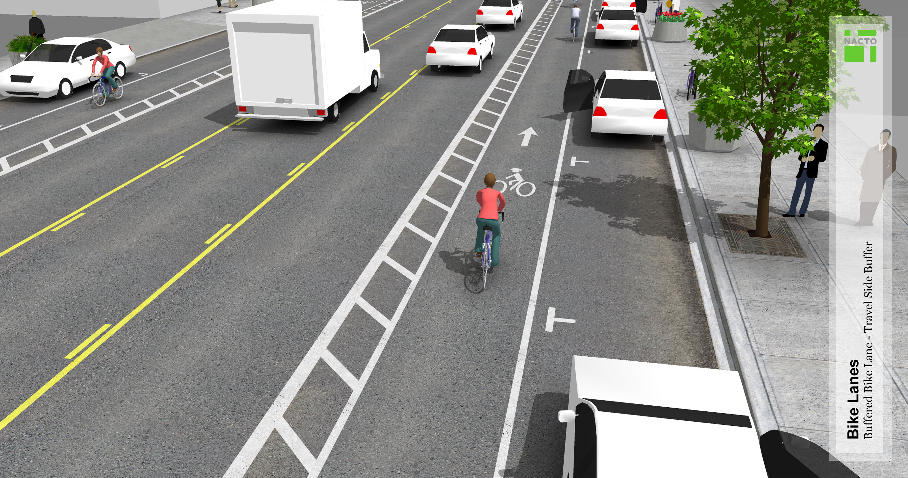
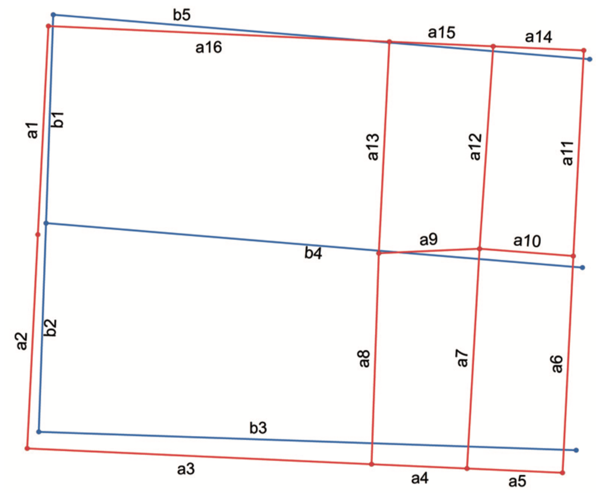

# Examining the Representativeness of OSM Bicycle Infrastructure in U.S. Cities

Cheter Harvey (working independently)

## Summary

This project will investigate the degree to which [OpenStreetMap](https://www.openstreetmap.org)(OSM) accuratly represents the availability of bicycle infrastructure (e.g., bike lanes) on roadways in U.S. cities. Planners and researchers increasingly draw on OSM as a free data source that spans diverse geographies. A limitation of the OSM project, however, is that many features are mapped only by volunteers. This means that certain types of OSM data may well-developed and accurate in some areas, but sparse or innaccurate in others. This project aims to develop a toolset for (1) quickly parsing OSM "tags" related to bicycle infrastructure, (2) relating these features to spatial datasets provided by local agencies (e.g., shapefiles or geojsons), which I assume to represent on-the-ground conditions, and (3) comparing the spatial and attribute distributions of the OSM and local datasets. Preliminarily, this analysis will focus on the cities of Portland, Oregon and Austin, Texas, which are the case studies for a broader study into which this work fits. My goal, however, will be to develop a toolset that can be easily applied to any city with publically-available infrastructure data. If time allows, I will experiment with analyzing a handful of other U.S. cities.

## Data and Software

### Data sources
- [OpenStreetMap](https://www.openstreetmap.org), accessed via the [Overpass API](https://wiki.openstreetmap.org/wiki/Overpass_API) using the [OSMnx](http://osmnx.readthedocs.io/en/stable/) package
- [Portland, Oregon bicycle facilities](http://gis-pdx.opendata.arcgis.com/datasets/bicycle-network)
- [Austin, Texas bicycle facilities](https://data.austintexas.gov/dataset/Austin-Bicycle-Facilities/kfe9-st9c)
- Bicycle facility geodata for other cities, as necessary

### Software Environment

This project will be developed in Python 3. It will draw heavily on the [Pandas](https://pandas.pydata.org/) and [GeoPandas](http://geopandas.org/) packages for tabular and geospatial analyses, and [Shapely](https://shapely.readthedocs.io/en/latest/project.html) for manipulation of geometric shapes. OSM data will be accessed using [OMNnx](http://osmnx.readthedocs.io/en/stable/), a wrapper for OSM's [Overpass API](https://wiki.openstreetmap.org/wiki/Overpass_API), developed by my Berkeley [DCRP](https://ced.berkeley.edu/academics/city-regional-planning/) colleague, [Geoff Boeing](http://geoffboeing.com/). Spatial indexing, to economize spatial joining, will be facilited by the [Rtree](http://toblerity.org/rtree/) package. Miscellaneous calculations and matrix  manipulation will be facilitated by [Numpy](http://www.numpy.org/). Plotting and mapping will be facilitated by the GeoPandas `plot()` method, which draws on [Matplotlib](https://matplotlib.org/).

Functions and classes developed for this project will be added as a module to my alpha-stage package for measuring and analyzing streets: [StreetSpace](https://github.com/chesterharvey/StreetSpace). The project will draw on existing StreetSpace functions where they are useful.

### Documentation

Docstrings for functions and classes developed for this project will be formatted to the [Sphinx](http://www.sphinx-doc.org/en/master/) standard to facilitate automated publishing as part of the [StreetSpace documentation](http://streetspace.readthedocs.io/en/latest/?badge=latest), hosted by [ReadtheDocs](https://readthedocs.org/).

A project narrative, including a description of developed functions and plots summarizing analyses, will be documented in a [Jupyter Notebook](http://jupyter.org/) and compiled for submission as a Pandoc-formatted PDF. All work will be documented on GitHub.

## Project Outline

### 1. OSM Data Parsing

OSM feature attributes are stored in a tag-based schema that is extreemly flexible but can make it difficult to consistently identify complex characteristics. For example, information for identifying a *buffered bike lane* (Figure 1) is generally stored in the *cycleway* key, but may be nested in subkeys specifying directionality, including *cycleway:backward*, *cycleway:right*, *cycleway:left*, and *cycleway:both*. Values, for any of these keys, that specify if a cyclway is buffered include *track* and *opposite_track* according to the official OSM documentation, but mappers in some U.S. cities have preferred to use *buffered_lane*. There is no explicit validation to ensure that conventions for either keys or values are followed. Thus, parsing something as simple as a buffered bike lane may require a complex function to search dozens of potential key-value combinations.

The first step of this project will be developing a function (or class structure) to parse raw OSM JSONs into categorical cycleway types stored in a tidy, tabular format, with conventional cycleway types specified for each block-length street segment within a city's boundary.

*Figure 1. Buffered Bike Lane*

### 2. Conflating OSM & Local Datasets

A common obstacle to utilizing OSM data is relating it to features in another dataset. The most common approach for *conflating* geometric features is to relate them to the closest feature in another dataset. However, this approach breaks down when there is not a 1:1 relationship between features. For example, in Figure 2, it is fairly straightforward to match *a2* and *b2* (1:1 coorespondance), but more difficult to recognized that *a3* relates to only a portion of *b3* (1:m coorespondance), while *a8* doesn't relate to any *b* feature (1:0 coorespondance). [Li and Goodchild (2011)](https://www.tandfonline.com/doi/abs/10.1080/19479832.2011.577458) develop an approach using directed Hausdorff distances to identify these 1:m and 1:0 coorespondances between feature sets. I aim to reproduce their approach, and, time permitting, explore an approach for identifying m:n coorespondances, where endpoints do not align between feature sets. I will develop a function (or class structure) that takes two GeoDataFrames as inputs and outputs a conflated geodataframe with consolidated tabular attributes.

*Figure 2. Conflating Segments* (Li and Goodchild, 2011, p. 324)

### 3. Analyzing Similarity Between OSM and Local Datasets

Once OSM features are parsed and conflated with local datasets, I will examine the degree to which OSM accuratly represents bicycle infrastructure within each study city. I will assume that local datasets represent "true" conditions, and compare the proportion of locally-documented bikeway features that are similarly documented by OSM. I will also compare the spatial and frequency distributions of bikeway features within each city. These comparisons will be illustrated by multi-panel graphs and maps.
